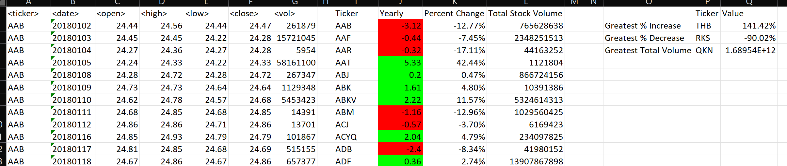
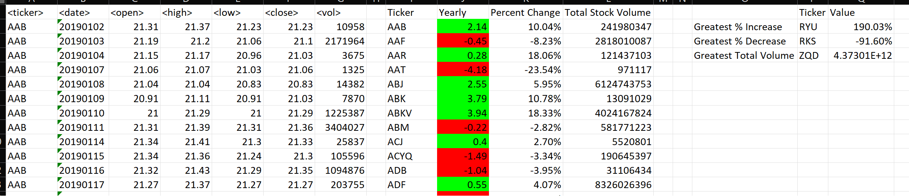
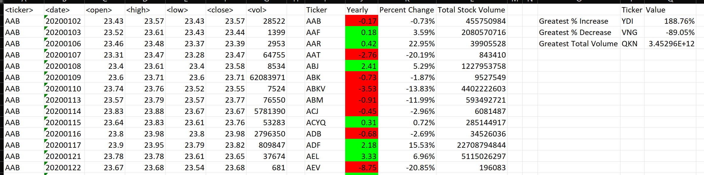

# VBA-challenge

# Images

# Method and attachments
Updated alphabetical-testing workbook to xlsm file type and used as test for main assignment.
VBA Code is pasted below for each step.
Isolated 4 new column results by testing individually.
Combined to one VBA Script.
    Saved as vb file "fournewcolumns"

Then worked on conditional formatting of Yearly change column to include color based on positive and negative values.
    Saved as vb file "FormatYearly2"

Created final table of Greatest Increase, Decrease, and Total Stock Volume by using 2 Subroutines.

    Saved as vb files "MinMax" and "AlphaLastTest"

Updated Multiple-year-stock-data to xlsm file type and tested VBA scripts used on alphabetical-testing workbook.

# References
Data for this dataset was generated by edX Boot Camps LLC, and is intended for educational purposes only.

Min and Max Value code provided by User Pm Duda on September 5, 2018 in Stack Overflow.

Received helpful suggestion to add ws to each Range and Cells of code through AskBCS Learning Assistant Luke Snyder on Sunday, September 17, 2023.